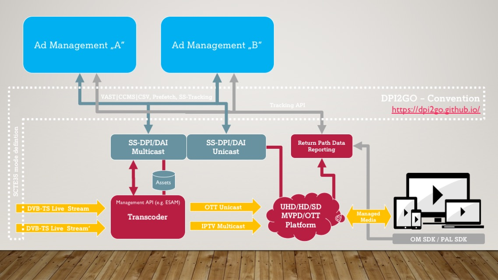

## The DPI2GO Convention at a glance! 

To generate a positive return on the Digital Program Insertion (DPI), the systems do not have just to be inexpensive and robust, but also have to be largely standards-based.

To increase advertising revenue through regionalization and personalization, the systems must also be modular and flexible. 

To maintain customer satisfaction, the network of systems must ensure the highest quality in both programs and advertising.

The joint creation of harmonised and easily applicable requirement conventions by industry partners is intended to promote the practical implementation of Digital Program Insertion (DPI) in various markets with different cooperation partners and to ensure that expectations are met.

One of the most important aspects in the video business is the correct and effective placement of advertising, whether at national, regional or individual level. 

Placing advertising according to demand is a key component of any channel operator's business model. 

In order to secure a larger share of the spot advertising market, the ability to place advertising in specific "zones", "clusters" or "personalized" is a key competitive advantage. For these reasons, digital program insertion (DPI) has quickly become an important part of the landscape. 

It is essential that channel operators and advertising marketers have the same access to digital program insertion functionality via all video playout and distribution platforms of their digital programs, linear & interactive . 

This convention should help to simplify and accelerate the market-wide implementation of digital programme insertion functionality in different countries. 

| Join the “give to give” philosophy and drive more success for all! |
| :----------------------------------------------------------: |
|                                                              |

Although the documents presented here were primarily prepared as a binding supplement to the tendering procedures, they are also suitable for general agreement on the content of the requirements between industrial partners.

All industry participants who become aware of these documents are kindly invited to contact their customers and/or partners in order to discuss the synergy potential or to participate in the further development of the convention presented here.

**If we got your attention, head over to [the requirement convention](https://github.com/dpi2go/dpi2go.github.io/blob/master/README.md) or [the repository.](https://github.com/dpi2go/dpi2go.github.io)**

|                     How to get involved?                     |
| :----------------------------------------------------------: |
| If you are missing an item in the requirement convention, something is unclear and requires better documentation or you have a better solution for a current requirement: Get Involved! |
| **<a href='https://github.com/dpi2go/dpi2go.github.io/issues' class='btn btn-primary'>Raise an Issue </a> • <a href='https://github.com/dpi2go/dpi2go.github.io/pulls' class='btn btn-primary'>Open a Pull-Request</a>** |

Note: Unfortunately, we cannot guarantee that no printing errors have occurred despite careful preparation and checking.

